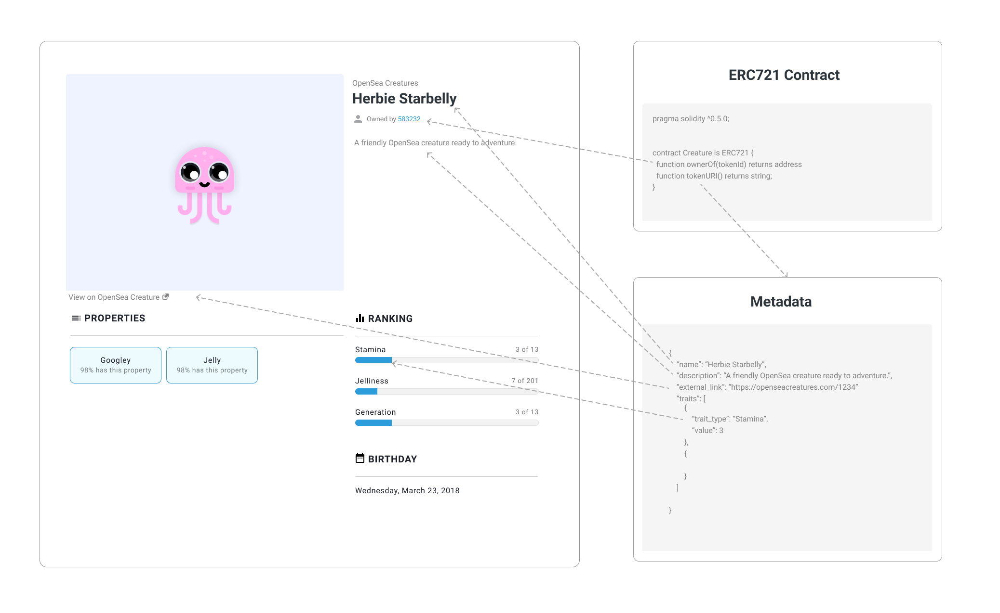
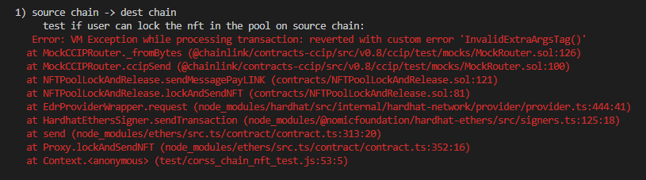

## 跟据 chainlink 的课程，写的 ts 版本的跨链 NFT 项目。
下面是从 0-1 的所有内容笔记，以及编写过程中踩的坑。
项目是可以运行的， tx 数据真实可查。

--- 

## 创建 NFT

### 1.通过 openzeppelin 创建样版合约文件

地址：https://wizard.openzeppelin.com/#erc20&name=MyToken&symbol=MTK


### 2.filebase 存储图片、json 文件

链上存储的一般是图片地址，真实的图片存在去中心化节点上（IPFS），自建 ipfs 繁琐，可使用 firebase 代替，firebase 类似云存服务，有存储桶，可上传、存储文件。

先将文件上传存储，获取地址，在编写 json 文件，上传。

json 文件有 opensea metedata 存储标准，文档如下：

https://docs.opensea.io/docs/metadata-standards



### 3.配置图片地址

正常通过配置 baseurl 即可，部署完合约，设置进去，自动匹配 tokenid 文件。

如下：0x7BC5d353663C4c94fd022d3df0642B56C174B45c chinachic 国潮的合约


这里直接写入，没有配置


### 4.使用 remix 部署

hardhat 使用需要配置很多东西，只是简单部署看效果，可以使用 remix 用来测试。链接小狐狸测试，完成 mint 后，可通过 testnets.opensea.io 测试网站查看效果。

## 跨链 NFT

### 1.基础

通证跨链：将通证从一条链转移到另一条链

可编程的通证跨链：将通证以及相关的指令从一条链转移给另一条链用于接受的智能合约

任意信息跨链：将任意信息（字节）从一条链转移给另一条链用于接受的智能合约

CCIP 主要组件


commit：


bless：


execute：


通证跨链


其他方式


NFT 跨链示意图


### 2.新建跨链合约 ，用来在其他链上铸造

WrappedMyToken.sol，集成原有合约，添加指定 id 铸造方法

```JavaScript
// SPDX-License-Identifier: MIT 
pragma solidity ^0.8.22;

import {MyToken} from "./MyToken.sol";

contract WrappedMyToken is MyToken {
    constructor(
        string memory tokenName,
        string memory tokenSymbol
    ) MyToken(tokenName, tokenSymbol) {}

    function mintTokenWithSpecificTokenId(address to, uint256 tokenId) public {
        _safeMint(to, tokenId);
        _setTokenURI(tokenId, tokenUrlMap[tokenId]);
    }
}
```

### 3.新建 lock release 合约，用来锁定和释放原链的 NFT

使用 chain ccip 跨链任意数据

文档：https://docs.chain.link/ccip/tutorials/send-arbitrary-data

编写方法完成 lock release 功能

```JavaScript
// SPDX-License-Identifier: MIT
pragma solidity ^0.8.24;

import {IRouterClient} from "@chainlink/contracts-ccip/src/v0.8/ccip/interfaces/IRouterClient.sol";
import {OwnerIsCreator} from "@chainlink/contracts-ccip/src/v0.8/shared/access/OwnerIsCreator.sol";
import {Client} from "@chainlink/contracts-ccip/src/v0.8/ccip/libraries/Client.sol";
import {CCIPReceiver} from "@chainlink/contracts-ccip/src/v0.8/ccip/applications/CCIPReceiver.sol";
import {IERC20} from "@chainlink/contracts-ccip/src/v0.8/vendor/openzeppelin-solidity/v4.8.3/contracts/token/ERC20/IERC20.sol";
import {SafeERC20} from "@chainlink/contracts-ccip/src/v0.8/vendor/openzeppelin-solidity/v4.8.3/contracts/token/ERC20/utils/SafeERC20.sol";
import {MyToken} from "./MyToken.sol";

contract NFTPoolLockAndRelease is CCIPReceiver, OwnerIsCreator {
...
    // 自定义函数部分
    MyToken public nft;

    // 发送 nft 解锁事件
    event TokenUnlocked(
        uint256 tokenId, // The 解锁的 tokenId.
        address newOwner // The address 解锁的地址.
    );
    
    // 用来发送将 nft lock 消息 在目标链 mint nft
    function lockAndSendNFT(
        uint256 tokenId,
        address newOwner,
        uint64 chainSelector,
        address receiver
    ) public returns (bytes32) {
        // 转移 NFT 到这个地址，锁定
        nft.transferFrom(msg.sender, address(this), tokenId);
        // 编码数据 发送
        bytes memory payload = abi.encode(tokenId, newOwner);

        bytes32 messageId = sendMessagePayLINK(
            chainSelector,
            receiver,
            payload
        );

        return messageId;
    }
    
    // 用来接收目标链 burn nft 的消息 解锁 nft 消息
    function _ccipReceive(
        Client.Any2EVMMessage memory any2EvmMessage // onlyAllowlisted(
        // any2EvmMessage.sourceChainSelector,
    ) internal override // abi.decode(any2EvmMessage.sender, (address))
    // ) // Make sure source chain and sender are allowlisted
    {
        // 自定义逻辑
        // 获取 发送的数据 address newOwner
        RequestData memory rd = abi.decode(any2EvmMessage.data, (RequestData));
        uint256 tokenId = rd.tokenId;
        address newOwner = rd.newOwner;

        // 将 nft 转出
        nft.transferFrom(address(this), newOwner, tokenId);

        emit TokenUnlocked(tokenId, newOwner);
    }
...
}
```

### 4.新建 burn mint 合约，用来铸造和燃烧目标链的 NFT

```JavaScript
// SPDX-License-Identifier: MIT
pragma solidity ^0.8.24;

import {IRouterClient} from "@chainlink/contracts-ccip/src/v0.8/ccip/interfaces/IRouterClient.sol";
import {OwnerIsCreator} from "@chainlink/contracts-ccip/src/v0.8/shared/access/OwnerIsCreator.sol";
import {Client} from "@chainlink/contracts-ccip/src/v0.8/ccip/libraries/Client.sol";
import {CCIPReceiver} from "@chainlink/contracts-ccip/src/v0.8/ccip/applications/CCIPReceiver.sol";
import {IERC20} from "@chainlink/contracts-ccip/src/v0.8/vendor/openzeppelin-solidity/v4.8.3/contracts/token/ERC20/IERC20.sol";
import {SafeERC20} from "@chainlink/contracts-ccip/src/v0.8/vendor/openzeppelin-solidity/v4.8.3/contracts/token/ERC20/utils/SafeERC20.sol";
import {WrappedMyToken} from "./WrappedMyToken.sol";

contract NFTPoolBurnAndMint is CCIPReceiver, OwnerIsCreator {
...
    // 自定义函数部分
    WrappedMyToken public wnft;

    // 发送 nft mint 事件
    event TokenMinted(
        uint256 tokenId, // The 解锁的 tokenId.
        address newOwner // The address 解锁的地址.
    );
    
    // 用来发送将 nft burn 消息 在原链 release nft
    function burnAndSendNFT(
        uint256 tokenId,
        address newOwner,
        uint64 chainSelector,
        address receiver
    ) public returns (bytes32) {
        // 转移 NFT 到这个地址，锁定
        wnft.transferFrom(msg.sender, address(this), tokenId);
        // 烧掉 nft 发送消息
        wnft.burn(tokenId);
        bytes memory payload = abi.encode(tokenId, newOwner);
        bytes32 messageId = sendMessagePayLINK(
            chainSelector,
            receiver,
            payload
        );
        return messageId;
    }
    
    // 使用结构体解析发送的编码数据
    struct RequestData {
        uint256 tokenId;
        address newOwner;
    }
    
    // 用来接收 nft lock 消息 在目标链 mint nft
    function _ccipReceive(
        Client.Any2EVMMessage memory any2EvmMessage // onlyAllowlisted(
        // abi.decode(any2EvmMessage.sender, (address))
    ) internal override // any2EvmMessage.sourceChainSelector,
    // ) // Make sure source chain and sender are allowlisted
    {
        // 自定义逻辑
        // 获取 发送的数据 address newOwner
        RequestData memory rd = abi.decode(any2EvmMessage.data, (RequestData));
        uint256 tokenId = rd.tokenId;
        address newOwner = rd.newOwner;
        
        // 目标链 mint nft
        wnft.mintTokenWithSpecificTokenId(newOwner, tokenId);

        emit TokenMinted(tokenId, newOwner);

        s_lastReceivedMessageId = any2EvmMessage.messageId; // fetch the messageId
        s_lastReceivedText = abi.decode(any2EvmMessage.data, (string)); // abi-decoding of the sent text

        emit MessageReceived(
            any2EvmMessage.messageId,
            any2EvmMessage.sourceChainSelector, // fetch the source chain identifier (aka selector)
            abi.decode(any2EvmMessage.sender, (address)), // abi-decoding of the sender address,
            abi.decode(any2EvmMessage.data, (string))
        );
    }
...
}
```

**注意** 由于发送的 encode 数据是 tokenId 和 newOwner，需要使用结构体转化数据，类型 json 的序列化操作，然后再进行取值。

## 合约部署脚本

新建 deploy 文件夹，创建 deploy.ts 用来部署脚本

hardhat-deploy 文档：https://github.com/wighawag/hardhat-deploy-ethers#readme

由于涉及 ccip 合约，在本地环境需要使用 mock 合约，

**ccip mock 合约**

```JavaScript
// SPDX-License-Identifier: MIT 
pragma solidity ^0.8.19;

import {CCIPLocalSimulator} from "@chainlink/local/src/ccip/CCIPLocalSimulator.sol";
```

部署脚本 

0_deplpy_ccip.ts

```JavaScript
import { deployments, getNamedAccounts, network } from "hardhat";
import { DeployFunction } from "hardhat-deploy/dist/types";

const deployCCIP: DeployFunction = async () => {
    const { firstAccount } = await getNamedAccounts();
    const { deploy, log } = deployments;

    log("Chainlink-ccip 部署合约中。。。")
    await deploy("CCIPLocalSimulator", {
        contract: "CCIPLocalSimulator",
        from: firstAccount,
        log: true
    });
    log("Chainlink-ccip 部署完成");
}
export default deployCCIP;

deployCCIP.tags = ["test", "all"]
```

1_deploy_nft.ts

```JavaScript
import { deployments, getNamedAccounts } from "hardhat";
import { DeployFunction } from "hardhat-deploy/dist/types";

const deployMyToken: DeployFunction  = async () => {
    const { firstAccount } = await getNamedAccounts();
    const { deploy, log } = deployments;

    log("MyToken 部署合约中。。。")

    await deploy("MyToken", {
        contract: "MyToken",
        from: firstAccount,
        log: true,
        args: ["MyToken", "MT"]
    });

    log("MyToken 部署完成");
}

export default deployMyToken;
deployMyToken.tags = ["sourcechain", "all"]
```

2_deploy_lock_release.ts

```JavaScript
import { deployments, ethers, getNamedAccounts } from "hardhat";
import { DeployFunction } from "hardhat-deploy/dist/types";

const deployNFTPoolLockAndRelease: DeployFunction = async () => {
    const { firstAccount } = await getNamedAccounts();
    const { deploy, log } = deployments;

    log("NFTPoolLockAndRelease 部署合约中。。。")

    // 参数 address _router, address _link, address _nftAddr
    const ccipDeployment = await deployments.get("CCIPLocalSimulator");
    const ccip = await ethers.getContractAt("CCIPLocalSimulator", ccipDeployment.address);
    const ccipConfig = await ccip.configuration();
    const sourceRouter = ccipConfig.sourceRouter_;
    const link = ccipConfig.linkToken_;

    const nftDeployment = await deployments.get("MyToken");
    // const nft = await ethers.getContractAt("MyToken", nftDeployment.address)
    const nftAddr = nftDeployment.address;

    await deploy("NFTPoolLockAndRelease", {
        contract: "NFTPoolLockAndRelease",
        from: firstAccount,
        log: true,
        args: [sourceRouter, link, nftAddr]
    });

    log("NFTPoolLockAndRelease 部署完成");
}

export default deployNFTPoolLockAndRelease;
deployNFTPoolLockAndRelease.tags = ["sourcechain", "all"]
```

另外的 3_deploy_wnft.ts、4_deploy_burn_mint.ts 类似

## 合约测试脚本

cross-chain-nft.test.ts

测试内容：

1.测试 用户可以成功 mint nft

2.测试 用户可以在原链 lock nft

3.测试 用户可以在目标链 mint wnft

4.测试 用户可以在目标链 burn wnft

5.测试 用户可以在原链 release nft

```JavaScript
import { expect } from 'chai';
import { deployments, ethers, getNamedAccounts } from 'hardhat';
import { CCIPLocalSimulator } from './../typechain-types/@chainlink/local/src/ccip/CCIPLocalSimulator';
import { MyToken, NFTPoolBurnAndMint, NFTPoolLockAndRelease, WrappedMyToken } from './../typechain-types/contracts';

// 1.测试 用户可以成功 mint nft

// 2.测试 用户可以在原链 lock nft
// 3.测试 用户可以在目标链 mint wnft

// 4.测试 用户可以在目标链 burn wnft
// 5.测试 用户可以在原链 release nft

// 测试前准备
let firstAccount: string;
let secondAccount: string;
let ccip: CCIPLocalSimulator;
let nft: MyToken;
let nftPoolLockAndRelease: NFTPoolLockAndRelease;
let wnft: WrappedMyToken;
let nftPoolBurnAndMint: NFTPoolBurnAndMint;
let chainSelector: bigint;

before(async function () {
    // const demo = await ethers.getSigners();
    firstAccount = (await getNamedAccounts()).firstAccount;
    secondAccount = (await getNamedAccounts()).secondAccount;
    await deployments.fixture(["all"]);

    ccip = await ethers.getContract("CCIPLocalSimulator", firstAccount);
    nft = await ethers.getContract("MyToken", firstAccount);
    nftPoolLockAndRelease = await ethers.getContract("NFTPoolLockAndRelease", firstAccount);
    wnft = await ethers.getContract("WrappedMyToken", firstAccount);
    nftPoolBurnAndMint = await ethers.getContract("NFTPoolBurnAndMint", firstAccount);

    const config = await ccip.configuration();
    chainSelector = config.chainSelector_;
    // at 从合约地址 实例化 合约
    // 没有 at 是从 部署地址获取合约
    // const nftDep = await deployments.get("MyToken");
    // nft = await ethers.getContractAt("MyToken", nftDep.address);
})

describe("原链功能测试", async function () {
    it("用户可以成功 mint nft", async function () {
        await nft.safeMint(firstAccount);
        await nft.safeMint(secondAccount);

        const totalSupply = await nft.totalSupply();
        console.log("nft 总 mint 数量", totalSupply.toString());

        const owner_1: string = await nft.ownerOf(0);
        const owner_2: string = await nft.ownerOf(1);
        expect(owner_1).to.equal(firstAccount);
        expect(owner_2).to.eq(secondAccount);
    })

    it("用户可以在原链 lock nft", async function () {
        // 允许 合约转移 token
        await nft.approve(nftPoolLockAndRelease.target, 0);
        // 通过 ccip 给 nft lock 合约地址领水    
        await ccip.requestLinkFromFaucet(
            nftPoolLockAndRelease,
            ethers.parseEther("10"));
        // nft 锁定 并 发送消息 铸造新链
        await nftPoolLockAndRelease.lockAndSendNFT(
            0,
            firstAccount,
            chainSelector,
            nftPoolBurnAndMint.target)

        const owner = await nft.ownerOf(0);
        expect(owner).equal(nftPoolLockAndRelease.target);
    })

    it("用户可以在目标链 mint wnft", async function () {
        const totalSupply = await wnft.totalSupply();
        console.log("wnft 总 mint 数量", totalSupply.toString());

        const owner_1: string = await wnft.ownerOf(0);
        expect(owner_1).to.equal(firstAccount);
    })

    it("测试 用户可以在目标链 burn wnft", async function () {
        // 允许 合约转移 token
        await wnft.approve(nftPoolBurnAndMint.target, 0);
        await ccip.requestLinkFromFaucet(
            nftPoolBurnAndMint,
            ethers.parseEther("10"));
        // nft 烧掉 并 发送消息 解锁原链
        await nftPoolBurnAndMint.burnAndSendNFT(
            0,
            firstAccount,
            chainSelector,
            nftPoolLockAndRelease.target
        )
        const totalSupply = await wnft.totalSupply();
        console.log("wnft 剩余数量", totalSupply.toString());
        expect(0).eq(totalSupply);
    })

    it("用户可以在原链 release nft", async function () {

        const owner = await nft.ownerOf(0);
        expect(owner).equal(firstAccount);
    })
})
```

## 多网络配置

### 1.基础

Eth sepolia 合约地址 文档

https://docs.chain.link/ccip/directory/testnet/chain/ethereum-testnet-sepolia

Polygon Amoy（80002） 合约地址 文档

https://docs.chain.link/ccip/directory/testnet/chain/polygon-testnet-amoy

领水地址**详见问题6，需要先领水，不然测试的时候会余额不足**

浏览器：

https://amoy.polygonscan.com/

### 2.编写配置

安装 dotenv，进行环境设置引入

```TypeScript
import '@nomicfoundation/hardhat-ethers';
import "@nomicfoundation/hardhat-toolbox";
import * as dotenv from "dotenv";
import 'hardhat-deploy';
import 'hardhat-deploy-ethers';
import { HardhatUserConfig } from "hardhat/config";
dotenv.config();

const PRIVATE_KEY = process.env.PRIVATE_KEY as string;
const SPEOLIA_URL = process.env.SPEOLIA_URL as string;
const AMOY_URL = process.env.AMOY_URL as string;

const config: HardhatUserConfig = {
  solidity: "0.8.27",
  namedAccounts: {
    firstAccount: {
      default: 0
    },
    secondAccount: {
      default: 1
    }
  },
  networks: {
    sepolia: {
      url: SPEOLIA_URL,
      accounts: [PRIVATE_KEY],
      chainId: 11155111
    },
    amoy: {
      url: AMOY_URL,
      accounts: [PRIVATE_KEY],
      chainId: 80002
    }
  }

};

export default config;
```

自定义环境配置的 networkConfig，使用 ts 要定义类型，不然在使用时，认为是 any 类型，类型不匹配。

```TypeScript
const networkConfig: {
    [chainId: number]: {
        name: string;
        router: string;
        linkToken: string;
    };
} = {
    11155111: {
        name: 'sepolia',
        router: '0x0BF3dE8c5D3e8A2B34D2BEeB17ABfCeBaf363A59',
        linkToken: '0x779877A7B0D9E8603169DdbD7836e478b4624789',
    },
    80002: {
        name: 'amoy',
        router: '0x9C32fCB86BF0f4a1A8921a9Fe46de3198bb884B2',
        linkToken: '0x0Fd9e8d3aF1aaee056EB9e802c3A762a667b1904',
    }
}
```

使用

```TypeScript
// chainId 有 undifine 可能，这里要转换
const chainId = network.config.chainId as number;
// 没有定义类型，这里就会报错
sourceRouter = networkConfig[chainId].router;
```

### 3.环境改写

跟据环境配置，进行合约的地址部署或直接使用已有合约

领水，修改链上测试网合约地址。

### 4.部署

部署完成后的合约地址：

**sepolia（eth）**

nft：0xA41Aab61481631Ba5Cc2DD377eC6F624D4ceE409

lock-release：0x22A438563e783Ef65b066A4A3Aa61Ea3CE4a6AF6

**amoy（polygon）**

wnft：0xAF0C0fc5b63513BEEABe488CD2D26143b695a899

burn-mint：0xb9bC33C6868D59D18933341DDD3E278A753BCc49

## 合约任务编写

编写 task 脚本，执行各个任务。编写遇到了**问题 5 ，**重复导入的问题，已解决。

写好的 task 任务，通过 index.ts 全部导入，在全部导出，使用方便。

check-nft.ts 使用的是指定导出

mint-nft.ts 使用的是命名导出

### 1.check-nft

```TypeScript
import { task } from "hardhat/config";
import { ConfigurableTaskDefinition, HardhatRuntimeEnvironment } from "hardhat/types";
import { MyToken } from "../typechain-types";

const taskCheck: ConfigurableTaskDefinition = task("check-nft")
    .setDescription("查询所有的 nft")
    .setAction(async (_, hre: HardhatRuntimeEnvironment) => {
        // 不能显示导入 初始化的时候可能没加载好 通过参数导入 springboot 的对象构建完成
        const { ethers, getNamedAccounts } = hre;

        const { firstAccount } = await getNamedAccounts();
        const nft: MyToken = await ethers.getContract("MyToken", firstAccount);

        const totalSupply = await nft.totalSupply();

        console.log("checking status of MyToken start");
        for (let tokenId = 0; tokenId < totalSupply; tokenId++) {
            const owner = await nft.ownerOf(tokenId);
            console.log(`TokenId: ${tokenId} - owner: ${owner}`);
        }
        console.log("checking status of MyToken end");
    })

export { taskCheck };
```

### 2.mint-nft

```TypeScript
import { task } from "hardhat/config";
import { HardhatRuntimeEnvironment } from 'hardhat/types';
import { MyToken } from '../typechain-types';

export default task("mint-nft")
    .setDescription("铸造原链的 nft")
    .setAction(async (_, hre: HardhatRuntimeEnvironment) => {
        const { getNamedAccounts, ethers } = hre;
        const { firstAccount } = await getNamedAccounts();
        const nft: MyToken = await ethers.getContract("MyToken", firstAccount);

        console.log("minting a nft from contract start");
        const mintTx = await nft.safeMint(firstAccount);
        mintTx.wait(6);
        console.log("nft minted");
    })
```

### 3.index.ts

```TypeScript
// 命名导入
import { taskCheck } from "./check-nft"
// 默认导入
import taskMint from "./mint-nft"

export { taskCheck, taskMint }
```

### 4.lock-cross

1.task 运行需要参数，通过 addOptionalParam（非必传）/ addParam（必传）传参。

2.获取非运行网络的合约，比如 --network sepolia，获取 amoy 的合约地址

hardhat 的网络配置中可以配置同伴网络（目标网络），通过 hre 环境获取

```TypeScript
// 配置
const config: HardhatUserConfig = {
  solidity: "0.8.27",
  namedAccounts: {
    firstAccount: {
      default: 0
    },
    secondAccount: {
      default: 1
    }
  },
  networks: {
    sepolia: {
      url: SPEOLIA_URL,
      accounts: [PRIVATE_KEY],
      chainId: 11155111,
      // 同伴网络
      companionNetworks: {
        destChain: "amoy"
      }
    },
    amoy: {
      url: AMOY_URL,
      accounts: [PRIVATE_KEY],
      chainId: 80002,
      companionNetworks: {
        destChain: "sepolia"
      }
    }
  }
};

// 获取
const burnMintDeployment: Deployment = 
await hre.companionNetworks["destChain"].deployments.get("NFTPoolBurnAndMint");
```

3.给 lock 合约转钱，用来支付 使用 的费用，前提是部署账户需要有 sepolia 的 link 水，问题 6 领水地址

4.lock 合约获取 nft 的转移权限

5.lock 合约发送 lock nft 的消息，并获取 hash

```TypeScript
import { Deployment } from "hardhat-deploy/dist/types";
import { task } from "hardhat/config";
import { HardhatRuntimeEnvironment } from "hardhat/types";
import { networkConfig } from "../helper-hardhat-config";
import { MyToken } from "../typechain-types";
import { NFTPoolLockAndRelease } from './../typechain-types/contracts/NFTPoolLockAndRelease';

export default task("lock-cross").setDescription("原链锁定 nft 发消息")
    // 命令行通过 --参数名称 传入，这里使用小写 取参数要一致
    // addOptionalParam 可选
    .addOptionalParam("chainselector", "chain selector of dest chain")
    .addOptionalParam("receiver", "receiver address on dest chain")
    .addParam("tokenid", "token id to be crossed chain")
    .setAction(async (taskArgs, hre: HardhatRuntimeEnvironment) => {
        const { ethers, getNamedAccounts, network, deployments } = hre;
        const { firstAccount } = await getNamedAccounts();
        const chainId = network.config.chainId as number;

        // 参数
        const tokenId = taskArgs.tokenid;
        let chainSelector = taskArgs.chainselector;
        let receiver = taskArgs.receiver;
        // 判断是否存在 不存在从配置文件取
        if (!chainSelector) {
            chainSelector = networkConfig[chainId].compainChainSelector;
            console.log("chainselector is not set in command");
        }
        console.log(`chainselector is ${chainSelector}`);

        if (!receiver) {
            // 需要使用 amoy 的 burn mint 合约地址
            // 在 hardhat config 中配置，让 hardhat 去找 amoy 的部署地址
            const burnMintDeployment: Deployment = await hre
                .companionNetworks["destChain"]
                .deployments
                .get("NFTPoolBurnAndMint");
            receiver = burnMintDeployment.address;
            console.log("receiver is not set in command");
        }
        console.log(`receiver is ${receiver}`);

        // 发送需要 fee （link）
        const linkAddress = networkConfig[chainId].linkToken;
        const linkContract = await ethers.getContractAt("LinkToken", linkAddress);
        const lockRelease: NFTPoolLockAndRelease = await ethers.getContract("NFTPoolLockAndRelease", firstAccount);
        // 转 fee
        const transTx = await linkContract.transfer(lockRelease.target, ethers.parseEther("10"));
        await transTx.wait(6);
        // 查询余额
        const balance = await linkContract.balanceOf(lockRelease.target);
        console.log(`balance of pool is ${balance}`);

        // 授权 ccip 转移 nft 权限
        const nft: MyToken = await ethers.getContract("MyToken", firstAccount);
        await nft.approve(lockRelease.target, tokenId)
        console.log("approve success");

        // 发送锁定消息
        const lockReleaseTx = await lockRelease.lockAndSendNFT(tokenId, firstAccount, chainSelector, receiver);

        console.log(`ccip tx is sent,tx hash is ${lockReleaseTx.hash}`);
        console.log("lock 完成");
    })
```

nft 的原链 lock、发送消息、目标链 mint


source tx：0x0da8ea5d0c5c79093088022cfadc63052865afb7008c66be71dd28906df1b046

### ccip 浏览器查询 tx

浏览器地址：https://ccip.chain.link/

大约会等 20min，先有 source tx，dest tx 会等待一段时间，防止攻击，status 最终变成 success


### 5.check-wnft

amoy 查询 nft 雷同 check-nft

### 6.burn-cross

在 amoy 上 burn nft，发消息，sepolia 收消息，解锁 nft。雷同 lock-cross。

做了一些优化：

1.给合约转账 gas 时，添加判断，如果余额足够，不需要再重复转账

2.nft approve 之前进行检查是否有权限，有的话，不需要重复 approve

```TypeScript
// 查询余额 如果够了 就不转了
let balance = await linkContract.balanceOf(burnMint.target);
let value = Number(ethers.formatEther(balance));
console.log(`balance of pool is ${value}`);

// amoy 很烂 容易超时 多试几次
if (value < 1) {
    console.log("合约余额不足, 需要转账");
    const transTx = await linkContract.transfer(burnMint.target, ethers.parseEther("1"));
    await transTx.wait(6);

    balance = await linkContract.balanceOf(burnMint.target);
    value = Number(ethers.formatEther(balance));

    console.log(`转账后的合约余额 ${value}`);
}

const wnft: WrappedMyToken = await ethers.getContract("WrappedMyToken", firstAccount);

// 查询是否有权限
const approveAddress = await wnft.getApproved(tokenId);
if (approveAddress !== burnMint.target) {
    // 没有授权
    console.log(`tokenid = ${tokenId} 没有授权给 address = ${burnMint.target}`);
    await wnft.approve(burnMint.target, tokenId);
} else {
    console.log(`tokenid = ${tokenId} 已授权给 address = ${firstAccount}`);
}
console.log("approve success");
```

tx：0x39225bff1690651182f92aa7729bf4b6f9111e646ce08cb63b6013ce38113417


## 遇到的问题

### 1.ts 文件中，如何引入写好的合约类型。

ts 文件中，定义变量需要给数据类型，合约类型，导入 sol 文件是不可行的（因为 sol 没有 export，ts 就没法 import），需要导入编译之后的合约，如果导入 baseContract ，合约调用时，会找不到方法。

可以先通过 npx hardhat compile 编译合约，编译完成后，在 typechain-types 文件夹中可以找到编译好的 ts 文件，并且在 index 中可以看到已经导出，这样就可以导入到测试文件中进行引用了。


### 2.ethers.getContractAt()、ethers.getContract() 区别

ethers.getContractAt("MyToken", deployedMyTokenAddress) 传入的是合约的地址。

ethers.getContract("MyToken", userAddress) 传入的是部署合约的那个账户地址。

```JavaScript
import { MyToken } from './../typechain-types/contracts';
import { deployments, ethers, getNamedAccounts } from 'hardhat';
let firstAccount: string;
let nft: MyToken;

before(async function () {
    firstAccount = (await getNamedAccounts()).firstAccount;
    await deployments.fixture(["all"]);
    
    const nftDep = await deployments.get("MyToken");
    nft = await ethers.getContractAt("MyToken", nftDep.address);
    
    nft = await ethers.getContract("MyToken", firstAccount);
})
```

### 3.官方文档更新，引发的校验问题

课程里的代码是 5 个月之前的，使用最新的 ccip 代码会报错。如下：



NFTPoolLockAndRelease 合约的 _buildCCIPMessage 方法修改传参：


具体的排查过程可以参考：

https://github.com/smartcontractkit/Web3_tutorial_Chinese/issues/15

### 4.可以在 node_modules 中修改代码

这也是在调试问题中，了解到的，在 java 开发中，引入库，如果是 jar 包是没法做修改的，除非是项目引入，没想到 node 都是这种个，在有问题的地方，可以修改代码，打印自己想到的东西，也可以直接进行修改。

### 5.task 文件不能 import hardhat

这是因为 Hardhat 的配置文件在被加载时会初始化 Hardhat 环境，但在配置文件本身加载时，无法同时初始化 Hardhat Runtime Environment (HRE)。

不能直接导入（不使用 import {} from "hardhat"），改为 setAciton 内部加载

```TypeScript
import { task } from "hardhat/config";
import { HardhatRuntimeEnvironment } from "hardhat/types";
// 不能直接导入
// import { deployments, getNamedAccounts } from "hardhat";
task("check-nft")
    .setDescription("查询所有的 NFT")
    .setAction(async (_, hre: HardhatRuntimeEnvironment) => {
        // 通过 hre 加载
        const { ethers, getNamedAccounts } = hre;
        
        const { firstAccount } = await getNamedAccounts();
        const nft = await ethers.getContract("MyToken", firstAccount);

        const totalSupply = await nft.totalSupply();

        console.log("Checking status of MyToken...");
        for (let tokenId = 0; tokenId < totalSupply; tokenId++) {
            const owner = await nft.ownerOf(tokenId);
            console.log(`TokenId: ${tokenId} - owner: ${owner}`);
        }
    });
```

### 6.领水地址

chain 的领水地址 https://faucets.chain.link/ 

需要领 sepolia 的 link 水， amoy 的 link 水，不然会报余额不足


其他

polygon-amoy 网络领水地址：

0.2 https://faucet.polygon.technology/ 

0.025 https://faucet.quicknode.com/polygon/amoy/ 

### 7.疑问 wnft 谁 mint 的？谁支付的 gas？

mint 的 tx 0x88f4ae54d5c38f2f69f9555a4defc53bd4529155b314682ac15efd7b508110f4

0x9f0fa75639F1926202B0db40d1EB63843b81E8CB

0x7Ad494C173f5845c6B4028a06cDcC6d3108bc960


